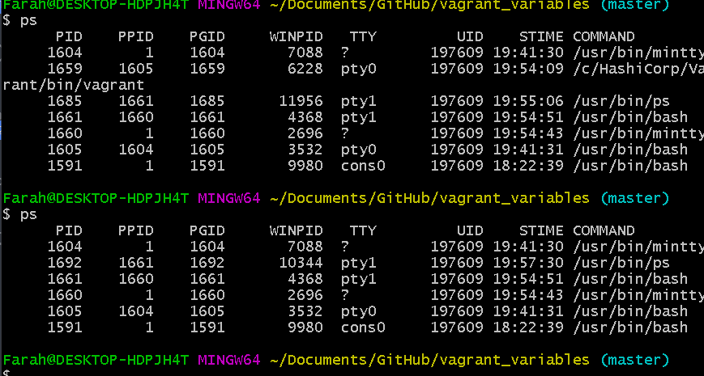
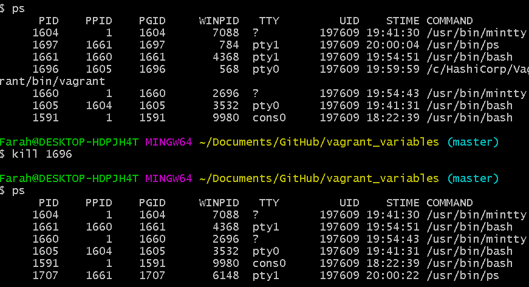
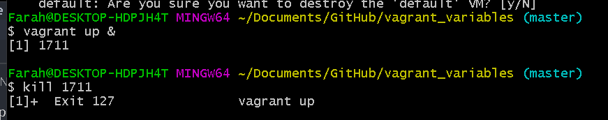

# Environment Variables

These exist globally on a speciific environment. Generally you don't want to have too many of them. And you can interpolate them into code and other services. 

## Agenda
- What are vairables vs Environment variable in Basg 
- Process and child process
    
- default variables 
- How to set the enironment variables in bash 


```bash
MY_VAR=hello
echo $MY_VAR
>hello
DIR=$(pwd)
echo $DIR
```

These variables are *not environment variables* and exist only in the current process (the current terminal). Once you restart the terminal these variables do not continue. 

## Child Process 
WHen your terminal runs another file or bash script it makes a child process. A child process is basically a new terminal. 

## Export 

You can use export to make a variable available to the child process:

```bash
MY_VAR=hello
export MY_VAR
./my_process.sh
> This is a line from my process
> hello
```

This is still not permanent, when you restart your terminal, it will be lost. 

## Making variable persistent in your computer
- The definitive response lies in understanding how terminals are created 
- the PATH taken
- Each individual terminal has a path to conclude before opening for you to type
- To set an environmennt variable  you are going to write in one of the files that it reads as it does its path. 


__You want to have this in .profile:__
```bash
#if running bash
if [-n "$BASH_VERSION" ]; then
    # include .bashhrc if it exists
    if [-f "$HOME/.bashrc ]; then
    "$HOME/.bashrc"
    fi
fi
```

## Concluding
we covered:
- variables VS local variables
- how variables run in scrip & child process
- how to create environment variables from variables
- how to make persistent variables that last between logons. 

# Bash Commands (H/W)

## Wildcards:
- `*` is like 'any'
```bash
$ ls
$ ls s*
```

- `?` When you know total number of characters
```bash
$ ls
$ ls ???pic.PNG
```
- [] to specify a range
```bash
$ ls
$ ls [p-z0-9]*.*
```
- Grep searches the input files for lines containing a match to a given pattern list
```bash
grep [yf] /etc/group
> In the example, all the lines containing either a "y" or "f" character are displayed.
```
- Steams, piping
    - A Linux stream is data traveling in a Linux shell from one process to another through a pipe, or from one file to another as a redirect.

    - A pipe is a form of redirection (transfer of standard output to some other destination) that is used in Linux and other Unix-like operating systems to send the output of one command/program/process to another command/program/process for further processing.

    - ```bash
      ls -l | sed -e "s/[aeio]/u/g"   
      > first the command ls -l is executed
      > and its output, instead of being printed, is sent (piped) to the sed program
      > which in turn, prints what it has to.
      ```
    - in general you can do:
    ```bash
    command_1 | command_2 | command_3 | .... | command_N
    ```
- Grep and ps aux, using piping 
    - process status
    - grep can be used to filter

    - aux:
    ```bash 
    a:- This option prints the running processes from all users.

    u:- This option shows user or owner column in output.

    x:- This option prints the processes those have not been executed from the terminal.
    ```
    - Collectively the options "aux" print all the running process in system regardless from where they have been executed.
- Start Process and Send to Background
    - All commands up to this point have been run in the foreground. When you run a command in the foreground, the shell waits for it to finish before displaying another prompt and allowing you to continue. When you run a command in the background, you do not have to wait for the command to finish before running another command.
    ```bash
    ls -l | echo &
    > [1] 1640
    ```
    pipeline that sends the output of ls to echo, which sends it to the printer.
    - The [1] following the command line indicates that the shell has assigned job number 1 to this job.

- Find the process 
    - `ps` can be used to find the PPID of any process, in the case above the PPID is 1640. 
    - ps will only find processes that are running
    
- Kill the process that is in the background 
    - You need to find the PID number of the process you want to kill, e.g we vagrant destroy
    - 
    - 